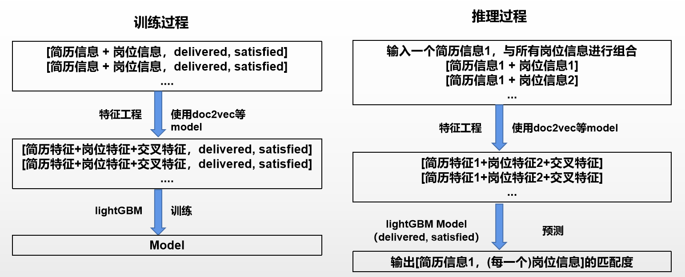

# 1、简介
本项目为智能简历推荐，为用户和公司双向推荐，使用lightGBM进行分类推荐。并使用flask进行封装。


# 2、目录结构
```txt
+---configs  # 存放配置文件
|       local_test.yml # 数据库连接信息、本地local host信息 

|   \---stopwords_files  # 停词文件，分词时使用
|           baidu_stopwords.txt
|           cn_stopwords.txt
|           hit_stopwords.txt
|           README.md
|           scu_stopwords.txt
|
+---models  # 训练的模型文件
|   +---exp0
|   |       all_feats_data.csv  # 保存中间过程的特征向量。便于直接训练，节省时间
|   |       d2v_model  # doc to vec模型，将文本转换成向量
|   |       job_description_cut.json  # 经过分词后的，中间文件，便于直接训练
|   |       readme.txt
|   |       lgb_delivered_model.txt  # [用户, 岗位] 预测用户是否投递该岗位的模型
|   |       lgb_satisfied_model.txt  # [用户, 岗位] 预测HR是否满意该用户的模型
|   |
|   doc2vec.py      # 【训练】 doc2vec训练模型
|   feats_utils.py  # 【训练】 特征工程 
|   train_model.py  # 【训练】 训练模型，不包含 tfidf，包含doc2vec和相似度
|   train_model2.py # 【训练】 训练模型，包含 tfidf，不包含doc2vec和相似度

|   connet_data.py         # 【推理】 连接数据库，处理空值、合并数据，生成可使用的数据形式
|   infer_feats_utils.py   #【推理】 特征工程 
|   infer_predict.py       # 【推理】常规推理 
|   flask_infer_predict.py #【推理】flask封装推理测试 
```


# 3、细节内容
  


**特征工程部分需要按照自己数据的特征进行适配**，比如简历和岗位的期望城市、期望职位、期望薪资是否相匹配(转换为0,1),
通过**doc2vec模型**将工作经验和职位描述各生成20维的特征向量，也可以将二者的向量进行距离计算，可作为相似度特征。

# 4、使用方法
**安装依赖：** `pip install -r requirements.txt`  
**训练：** 按照训练数据格式，更改训练数据有的特征。`python train_model2.py`   
**flask 推理：** 按照自己的数据库以及本地ip更改config中的配置文件。`python flask_infer_predict.py --cfg path/to/your_cfg.yml` 

# 5、TODO LIST
- [ ] 集群部署
- [ ] 数据库中不变的数据进行缓存(如分词后的结果，已经计算好的匹配度)
- [ ] flask高并发处理
- [ ] 挖掘更多特征工程


# 6、 Reference
https://github.com/juzstu/TianChi_ZhiLianZhaoPin  

